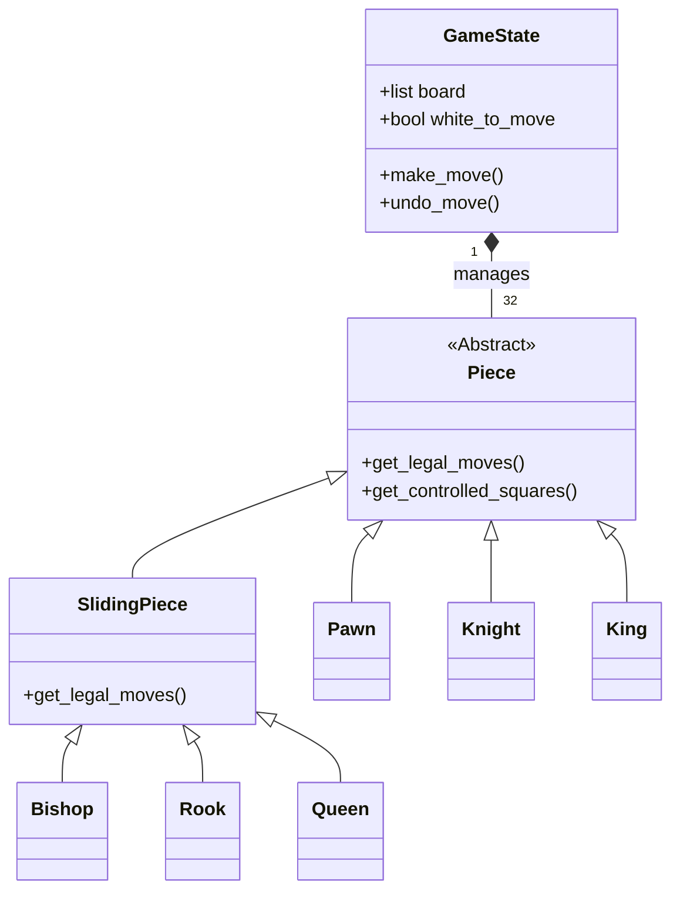

# Python Chess: An Object-Oriented Engine


> A strictly typed, event-driven chess implementation designed to demonstrate scalable software architecture and clean state management.

## Table of Contents
- [Project Philosophy](#project-philosophy)
- [Architecture & Design](#architecture--design)
- [Installation](#installation)
- [Usage](#usage)
- [Testing & Quality Assurance](#testing--quality-assurance)
- [Future Roadmap](#future-roadmap)
- [License](#license)


## Project Philosophy

This project represents a transition from functional prototyping to architectural design. Initially built to solve the raw logical challenges of chess (move generation, complex rules like *en passant*), the focus shifted toward software craftsmanship once the base logic was sound.

The current iteration serves as an exercise in iterative refactoring. By transitioning from procedural scripts to a strict Object-Oriented structure, I aimed to decouple the game engine from the interface, ensuring the system is not just functional, but scalable, testable, and maintainable.

## Architecture & Design

The project evolved from a procedural prototype to a strict Object-Oriented system. The core design relies on Polymorphism to handle piece movement and Encapsulation to manage board state.

Instead ofrelying on explicit piece type checks to determine legal moves, the `Piece` class is abstract. Subclasses (like `Pawn` or `Knight`) are forced to implement their own specific movement physics via the `get_legal_moves()` contract.

### Class Hierarchy (Mermaid)

### Key Engineering Decisions

To optimize performance, the engine employs a "Soft Delete" strategy for state management. Rather than destroying and recreating piece objects every turn (a computationally expensive process) captured pieces are simply flagged as inactive and retained in memory. This approach enables instantaneous Undo/Redo functionality by toggling the piece's boolean state, avoiding the overhead of reconstructing the board configuration from scratch.

A significant architectural challenge involved distinguishing between movement physics and square control. Early iterations conflated these concepts, leading to edge-case bugs where the King could castle through checks if the attacking piece was blocked from *moving* to that square (e.g., a blocked Pawn). I resolved this by decoupling `get_legal_moves()` from `get_controlled_squares()`. This ensures the engine correctly identifies "danger zones" for the King regardless of whether an enemy piece can legally move to that square in the current turn.

## Installation

### Prerequisites
* **Python 3.10** or higher
* **Pip** package manager

### Setup Guide
1.  **Clone the repository**
    ```bash
    git clone [https://github.com/Chessgeek-svg/ChessGame](https://github.com/Chessgeek-svg/ChessGame)
    cd chess-engine
    ```

2.  **Install Dependencies**

    It is recommended to use a virtual environment to avoid conflicts.
    ```bash
    # Create and activate virtual environment (Optional)
    python -m venv venv
    source venv/bin/activate  # Windows: venv\Scripts\activate

    # Install packages
    pip install -r requirements.txt
    ```
## Usage

To launch the GUI, execute the entry point script.

```bash
python main.py
```

### Controls
| Key/Input | Action |
| :--- | :--- |
| **Left Click** | Select / Move Piece |
| **Z** | Undo Move |

## Testing & Quality Assurance

Adhering to Test-Driven Development (TDD) was crucial for complex features like En Passant and Castling.
* **Framework:** `pytest`
* **Coverage:** Unit tests cover move generation, checkmate detection, and state restoration.

To run the test suite:
```bash
python -m pytest
```

## Future Roadmap
This project is currently a fully functional "Chess Kernel" (PvP and Rules Enforcement). The next phase of development focuses on adding a player vs computer option, and therefore incorporation of move selection algorithms:
- [ ] Implement Minimax Algorithm with Alpha-Beta Pruning.
- [ ] Add Board Evaluation heuristics (material + positional advantages).
- [ ] Optimize move generation performance for deeper search depth.

## License
Distributed under the MIT License. See [LICENSE](LICENSE.md) for more information.